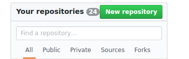
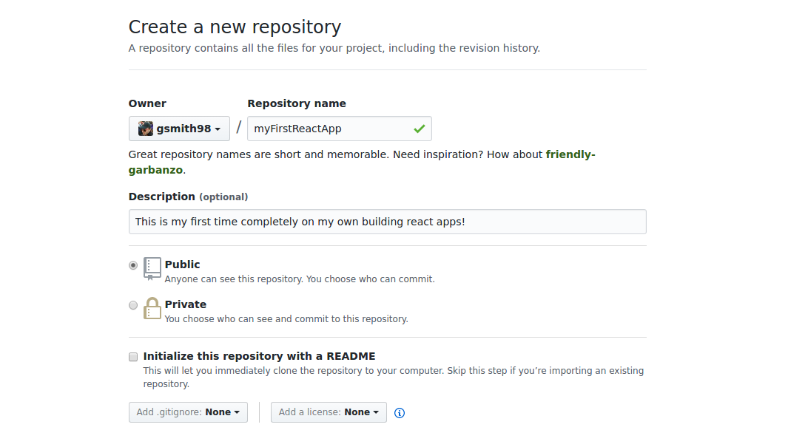
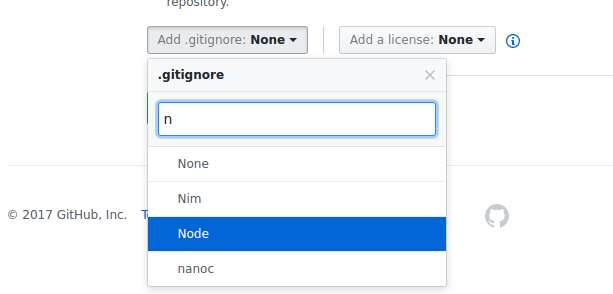
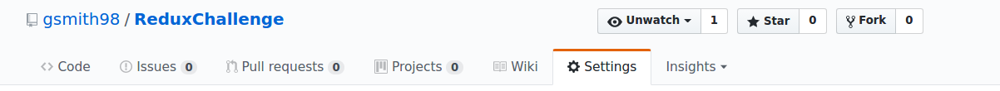
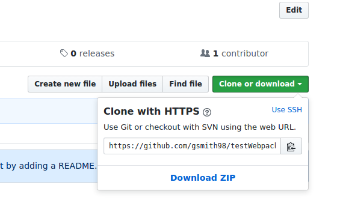

# Setting Up a Project with What You Learned at Horizons

This file details how you can get started on a project with a team or individually. If you have a past project to reference (you all do), we wish to emphasize that it is always a viable option to take some earlier project of yours and take out the pieces specific to it. Otherwise, this guide should provide you with a good template that you can save and use as a starting point for any future project. We welcome you to start from scratch if it will serve as an exercise to improve your understanding of your codebase, but once it stops being helpful to you you should absolutely just save a working starting point in your coder's toolbelt.

The parts in this doc you and your teammates may need to do together, but once the setup is complete you should be free to split off and work on different parts of the project in parallel.


Sections:
1. [git](#part-1-git)

1. [npm](#part-2-npm)

1. [Backend: Express Server](#part-3-backend-express-server)

1. [Frontend: Rendering](#part-4-frontend-rendering)


## Part 1: git

Whatever project you are working in, you probably are best off if your workflow revolves around git. git manages all versions of and changes to your code and supports amazing features such as branching and automatic merging. Without git and a remote hosting service such as Github, collaborating on code could be a nightmare.


1. Visit `github.com` and log in. You should see a button to create a new repository somewhere on the right hand side.

    

1. Fill out the page to give your repository a name and description.

    

1. Click the dropdown to add a `.gitignore` to your project. This will automatically generate a `.gitignore` file appropriate for a typical project of the given type, in our case `Node`.  

    

    The `.gitignore` file tells git which files it shouldn't bother tracking or pushing, either because it's unnecessary (like packages/dependencies) or straight up dangerous (like env files containing secret credentials). Any cred you accrue from having a cool React app on your profile could be thrown out the window if people see you pushed your entire `node_modules` directory like a goober.

1. Submit the form to be given a fresh github repo. The repo will be public unless you specifically choose for it to be private before submitting this form. If you want your repo to be private, you may need to pay a small amount. If your repo is public, be careful about only pushing things the public is permitted to see! No passwords, secrets, or backdoors!

1. While on the main page of you new repo, there are several configuration options that may interest you in the settings tab. Look around and get your repo set up the way your team wants. Some suggestions are preventing pushes to master (change master exclusively by making `pull requests` from 'feature branches'), restricting branch/commits to come from approved contributors only, and setting up any [github plugins](https://github.com/marketplace) you think might be neat.

    


1. For any collaborator to get the code to and from their machine, they first need to `clone` the repo. Navigate to your `horizons` folder and `git clone YOUR_CLONE_URL_HERE`. You can find the url to clone from on the right hand side of the page.

    


You should now have a directory with the same name as your online repository. The two will be linked so that when you `git push` it will push to your online repo, etc.


## Part 2: npm

npm is where all the package goodness is at. If you're using javascript you are definitely going to want it.

To turn your directory into an npm project. Run `npm init` in the root of the project directory. You will then be asked a bunch of questions about your project. These fields don't matter much unless you're publishing on `npm` or doing something serious, so you can just hit enter through the prompts. However, it may insist that you type a project name with no capitals if your repo/directory name has capital letters.

This should create a `package.json` for you, which among other things will list dependencies and easily install all of them on a new machine. This makes it a necessary tool for collaborating, be sure that if you add a new dependency you include it in `package.json` with the `--save` flag.

In `package.json`, there are actually two kinds of dependencies: dependencies and dev-dependencies. Dependencies are the tools required to run the code, whereas dev-dependencies are the tools needed/helpful while developing the code. For example, your `express` server needs `express` no matter what, but `nodemon` is just a dev tool for automatically restarting it while you are writing it and isn't actually a part of your tech stack. You can save dev-dependencies with the `--save-dev` flag. It's good practice to be mindful of this distinction and keep your dependencies as small as possible because it reduces the time it takes to install everything needed for production and also reduces the number of breaking points when booting a production machine.

## Part 3: Backend: Express Server

Many of your projects will require a server for some purpose. A server can respond to requests with html at different routes, it can respond with data pulled from a database to feed into your app, it can deliver your bundled app once and then be done, it can serve all your static assets, etc. You can choose any file name you like, but something like `server.js` makes it immediately obvious what the file does.

Your server will grow with your needs, but it can start in a number of different forms. You can use a tool like `express-generator` (which you used for Homazon), you can reference any past project and grab what you see, or you can start as fresh as possible with the pretty minimal [Hello World Example](https://expressjs.com/en/starter/hello-world.html) from Express' official docs. Whatever you choose, you'll be in the best shape picking either something you fully understand or something you can trust will work and will not need to pay any deeper attention to later.

You can confirm that the server is working by running it and then making some requests of it. You can run with `node serve.js`, which you may decide to put into `package.json` as `npm start` or `npm run server`. You can make requests with your browser or postman.

Don't forget that you'll need to have done `npm install --save express` to install `express` and add it to your dependencies. If a teammate needs `express` and is working with a `package.json` that another teammate already commited an additional dependency to, they won't need to do `npm install --save express` again; `npm install` will get any dependencies in `package.json` not already in the given user's `node_modules`.

## Part 4: Frontend: Rendering

In this course we have encountered multiple options that can be reasonably used to render your projects. Which you choose is up to you, and even some combination of these technologies is possible.


`jQuery` is a frontend tool that runs in the browser and uses css selectors to grab and work directly with DOM nodes. It can be used to modify or remove existing nodes, add new ones, or just set up click/event handlers (including by event delegation) for various purposes. It also comes with AJAX which can be used to make requests to a server. Having jQuery is also a requirement for using `bootstrap`.

<details>
  <summary>jQuery</summary>

  Your jQuery code is javascript that will run in the browser and interact with the DOM, so a number of things will be needed.

  1. There must be a page in the first place. You will need to write an HTML file that your express server will deliver to clients and that jQuery will work on. Here's a template of an HTML file. jQuery uses css selectors to get around, so when making elements in the body give them descriptive classes.

      ```html
      <!DOCTYPE html>
      <html>
        <head>
          <title>Webpage Title</title>
          <!-- SCRIPTS AND STYLESHEETS WILL GO HERE! -->
        </head>
        <body>
          <!-- YOUR HTML WILL GO HERE! -->
        </body>
      </html>
      ```

  1. The jQuery library will need to be obtained by the browser. We instruct the browser to do this with a `<script>` tag in the HTML head. Whatever the tag's `src` attribute is is where a `GET` request will be made that should respond with some javascript the browser is meant to run. There are 2 primary ways to get the jQuery library:

      1. A `CDN`. CDN stands for `Content Delivery Network` and is a means by which packages and assets are made publicly available. There are plenty of hosts out there that provide a url you can make a request to to get any version of jQuery (or any other common package) you want. You can easily find them by googling "jQuery CDN", or you can visit [the official jQuery site](https://code.jquery.com/) which offers several urls you can use to grab jQuery.  

      1. Download and host yourself. You can write your own express route that responds with a copy of the jQuery library that you've downloaded onto whatever machine is running express. For this you would typically put the downloaded jQuery in some public assets folder and serve the whole folder with [express.static](https://expressjs.com/en/starter/static-files.html). Then your `<script>`'s '`src` should be whatever route on your domain that just made available.

  1. Your jQuery code also needs to be obtained by the browser (after you've written it). Be sure all your jQuery code is inside a [$(document).ready](https://learn.jquery.com/using-jquery-core/document-ready/), or else all your css selectors will whiff since your script will run in the HTML head and there aren't any DOM nodes to select until the HTML body is done. Then serve it from a public folder with `express.static` and include a `<script>` tag with the appropriate `src` in your HTML head (__under__ the one getting jQUery, __order matters__!).

  This should be all that is needed to be able to use jQuery in your project.

</details>


Handlebars is a server-side rendering tool that enables you to write HTML templates (.hbs files) and populate their contents dynamically on the server to generate HTML with which to respond.

<details>
  <summary>Handlebars</summary>

  Handlebars is a pretty simple tool, most of the time it's just performing string replacements. As such, getting it set up is also pretty simple.

  1. We need an express middleware to add `res.render` to our normal express flow. We've actually used more than one version in this course, but this guide will [use express-handlebars](https://www.npmjs.com/package/express-handlebars). `npm install --save express-handlebars`.

  1. We've installed the `express-handlebars` middleware, but we aren't using it yet. You do this with:

      ```javascript
      const exphbs  = require('express-handlebars');

      app.engine('handlebars', exphbs({defaultLayout: 'main'}));
      app.set('view engine', 'hbs');
      ```

      This should be before any of your routes.

  1. The above has configured things such that Handlebars will look for .hbs files in the `views` directory, and it will use `views/layouts/main.hbs` as the layout. It might look like:

      ```html
      <!DOCTYPE html>
      <html>
      <head>
          <meta charset="utf-8">
          <title>Webpage Title</title>
          <!-- LINK TAG TO CSS STYLESHEET HERE -->
      </head>
      <body>

          {{{body}}}

      </body>
      </html>
      ```

      If you want to use jQuery in conjunction with Handlebars, that's as simple as making sure the same setup described in the jQuery section is done here. Your `<script>` tags will go in this `main.hbs`.

  With this done, you should be able to write .hbs files and use `res.render` to populate/hydrate them into HTML and respond with it.

</details>


React is a frontend framework that centers around modular building blocks called components. Much of your would-be HTML is instead javascript/JSX in a React project. Some consider React to be 'less manual' than alternatives like jQuery. React has a [suite of existing components](http://react-toolbox.com/#/) for you to leverage, it has some potentially enticing tools built on top of it (e.g. React-Router and Redux), and it is also available on mobile as React-Native. Developing in React comes at the one-time cost of some more involved setup.

<details>
  <summary>React</summary>

  When developing in React we are developing in JSX, not javascript. This means we need to run a preprocessor to translate (`transpile`) our code into javascript the browser can actually run. For this we use `webpack` to manage our builds and incorporate the preprocessor `Babel`. After this setup has produced an `app.bundle.js` that is in browser-compatible javascript, we're back in business.

  1. Start by making a simple javascript file that just imports React and ReactDOM and tries to `ReactDOM.render` a `<p>` tag. This is the code we will be trying to get working. Don't forget to `npm install` the needed packages for this file.

  1. The process of generating from this file a different file that will work in browser has a bunch of dependencies.

      ```bash
        npm install --save webpack@2 babel-core babel-loader babel-preset-react babel-preset-es2015
      ```

      Note: Whether these are dependencies or dev-dependencies will depend on your production flow. If your production machines (say heroku) will be building and then serving your app, then they need webpack and these are normal dependencies. If instead you plan to run a build yourself before committing/pushing the already built files to production, then production doesn't need webpack and these are dev-dependencies.

  1. A file `webpack.config.js` in the root of your project directory is responsible for specifying how the webpack build will work. You can start with this one, which you can later tinker with if the need to do so ever even arises.

      ```javascript
      const webpack = require('webpack');
      const path = require('path');

      module.exports = {
        entry: /*PATH TO YOUR FILE WITH THE ReactDOM.render CALL*/,
        output: {
          path: path.join(__dirname, '/build'),
          filename: 'app.bundle.js'
        },
        module: {
          rules: [
            {
              test: /\.js$/,
              exclude: /node_modules/,
              use: {
                loader: 'babel-loader',
                options: {
                  presets: ['es2015', 'react']
                }
              }
            }
          ]
        },
        stats: {
          colors: true
        },
        devtool: 'source-map'
      };
      ```

      This file configures webpack to translate the file you put in the `entry` key (and any other files needed in running that file) and spit the result out as `/build/app.bundle.js` as specified in the `output` key. Thus you should either make a `build` folder for this or change the behavior. When webpack isn't run with the production flag, your errors will contain the accurate line number in your source code thanks to the `devtool` key and the `map` file that also gets spat into the same folder as `app.bundle.js`.

  1. You will want to add some scripts to `package.json` that run webpack. You might have a `"build": "webpack"` that you can run with `npm run build`, and perhaps you want a separate script that does the same thing with the `-p` production flag which minifies/uglifies the resulting `app.bundle.js` so that clients download it quicker.

  1. With all that done, it will be possible to have your code in a browser-compliant javascript file named `/build/app.bundle.js`. The browser now needs this file. The way we get it to the browser is by having the browser request it from an HTML page via a `<script>` tag with an appropriate `src`, and we make our server deliver it. So use [express.static](https://expressjs.com/en/starter/static-files.html) to make the contents of the `build` folder GETable and create an `index.html` in the build `folder`:

      ```html
      <!DOCTYPE html>
      <html>
        <head>
          <title>Webpage Title</title>
        </head>
        <body>
          <div id='root'></div>
          <script type="text/javascript" src="/app.bundle.js"></script>
        </body>
      </html>
      ```

      Then if you use your browser to make a GET request to `/index.html`, the server will respond with `/build/index.html`, whose `<script>` tag in turn causes the browser to make a GET request to `/app.bundle.js` which responds with `/build/app.bundle.js`, which is everything you should need. Actually, the way serving static directories works is that if the requested resource is a folder, express will automatically attempt to serve a file contained in that folder with the name `index`. So a get request to `/` is identical to one to `/index.html` in this case.

  The `<p>` tag should now be successfully rendering in browser and you should be able to start using React. But there might be more you want to include in your project than just the minimum React.

  <details>
    <summary>Webpack Dev Server</summary>

    The webpack dev server is a lovely option for automatically serving and hot-reloading webpack during development. You may find it better than having to rebuild manually each time in a codebase that isn't using webpack as a middleware (see React-Chat for an example of webpack as express middleware if interested).

    1. `npm install --save-dev webpack-dev-server`

    1. Add a script to `package.json`: `"dev": "webpack-dev-server --content-base build/"`.

    Now you can run the dev server with `npm run dev`. It defaults to port 8080.

  </details>

  <details>
    <summary>Redux</summary>

    Redux is a state manager that is often used with React code as an alternative to using React's built in state, which comes with difficulties and annoyances on more complex projects. The Redux paradigm is that React user interactions cause actions to be dispatched, which get fed into a reducer which returns a new state. Then the React-Redux bindings (`connect` and co.) are used to feed state changes back into React, completing the cycle.

    1. `npm install --save redux react-redux`

    1. The following code will configure a Redux store that uses the supplied reducer to manage state. Put this in the entry point file that contains the `ReactDOM.render` call, or in a separate file and import this same store into said entry file.

        ```javascript
        import { createStore } from 'redux';
        // import reducer

        const store = createStore(/* YOUR REDUCER */);
        ```

    1. Somewhere near the top of your React app component hierarchy (could even be the very top: in the entry point file that in the `ReactDOM.render` call), wrap things in a `<Provider>` tag:

        ```javascript
        import { Provider } from 'react-redux';
        // import or create store

        ReactDOM.render(
          <Provider store={store}>
            <RestOfAppHere />
          </Provider>,
          document.getElementById('root')
        );
        ```

        Everything under the Provider tag in the hierarchy will be able to use Redux.

    1. When you want to use Redux in some container component under this Provider in the component hierarchy, `import { connect } from 'react-redux'`, write your `mapStateToProps` and `mapDispatchToProps`, and do `const WrappedMyComponent = connect(mapStateToProps, mapDispatchToProps)(MyComponent);`.

  </details>

  <details>
    <summary>React Router</summary>

    React Router lets you make multi-page React apps that are secretly single page, leading to lightning transitions and the ability to swap out only certain parts of the page.

    1. `npm install --save react-router-dom`

    *IF NO REDUX*

    1. `import { BrowserRouter } from 'react-router-dom';` and simply wrap your app in a single BrowserRouter like `<BrowserRouter><RestOfAppHere /></BrowserRouter>`. Then you're all set to start using Links and Routes and such in any component contained within the the BrowserRouter.

     *If REDUX*
     [Single file example in the Usage section here.](https://github.com/ReactTraining/react-router/tree/master/packages/react-router-redux)

    1. `npm install --save react-router-redux history`

    1. Define this `history` either in the entry file or in some other file that exports it so the entry file can import it.

        ```javascript
        import createHistory from 'history/createBrowserHistory';

        const history = createHistory();
        ```

    1. Within your Redux Provider but wrapped around the rest of your app, include a Connected Router using the `history` like so:

        ```javascript
        import { ConnectedRouter } from 'react-router-redux';

        // ...
          <Provider store={store}>
            <ConnectedRouter history={history}>
              <RestOfAppHere />
            </ConnectedRouter>
          </Provider>
        // ...
        ```javascript

    1. The reducer that you give to createStore will need to be the result of a `combineReducers` call that includes a key value pair `router: routerReducer` where routerReducer comes from `import { routerReducer } from 'react-router-redux'`. `combineReducers` comes from the `redux` package.

  That should be everything you need.

  </details>

</details>


## To Add!!

React Native  
mongoDB / mongoose / mLab  
passport  
linting  
